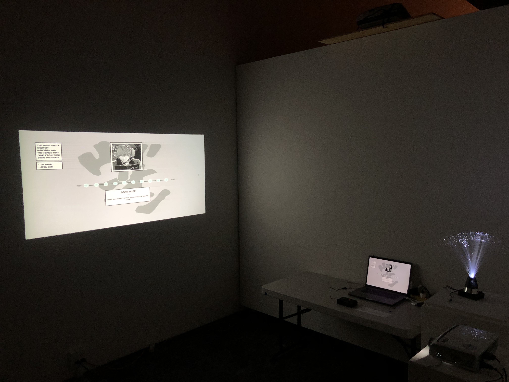
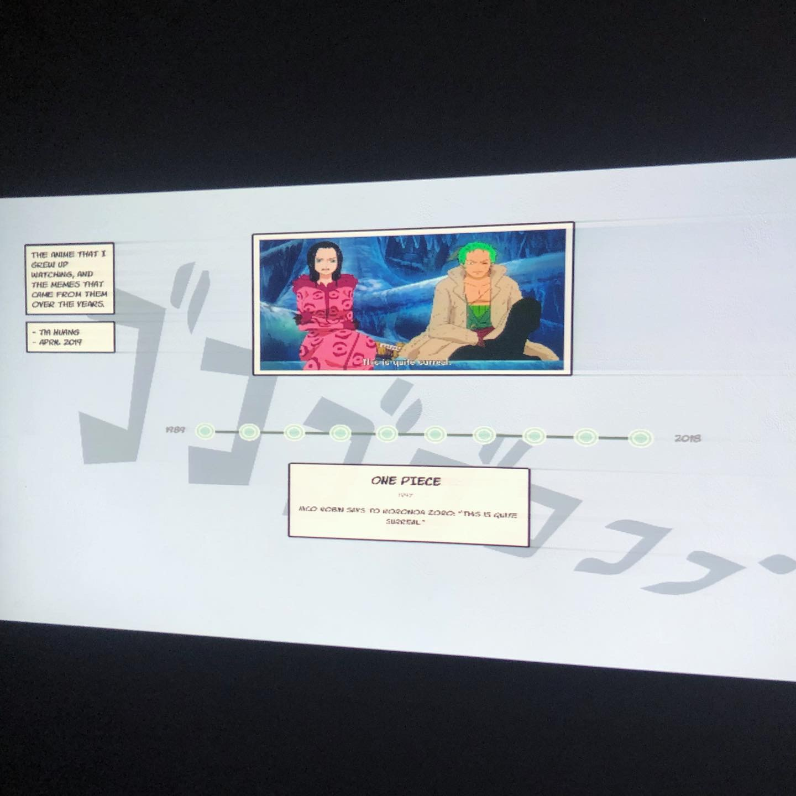
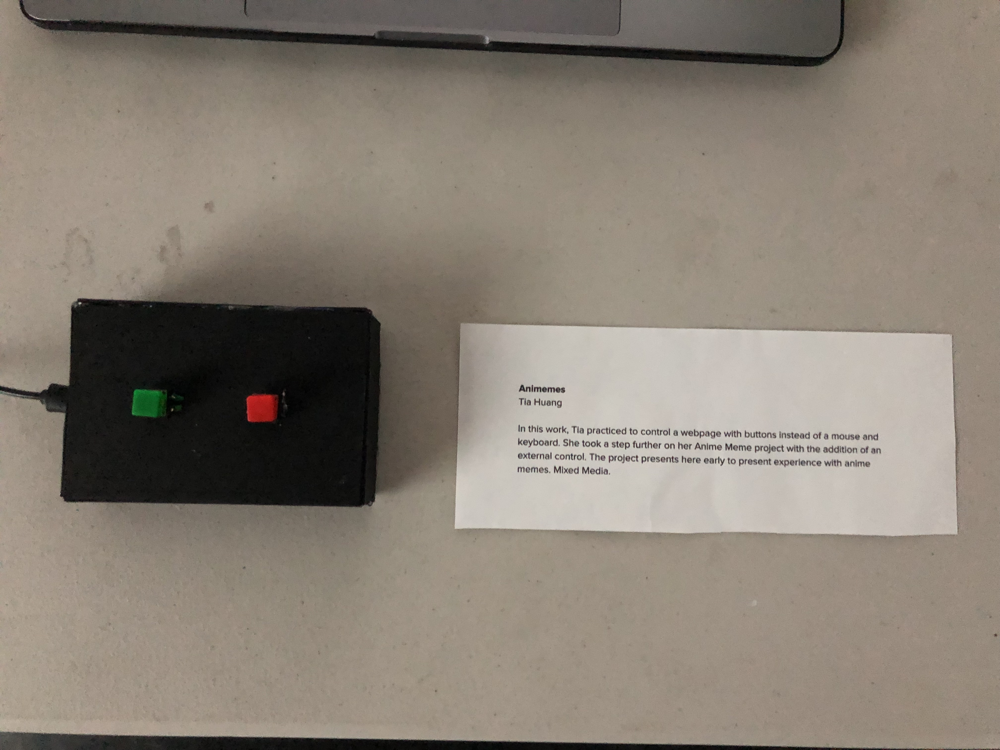
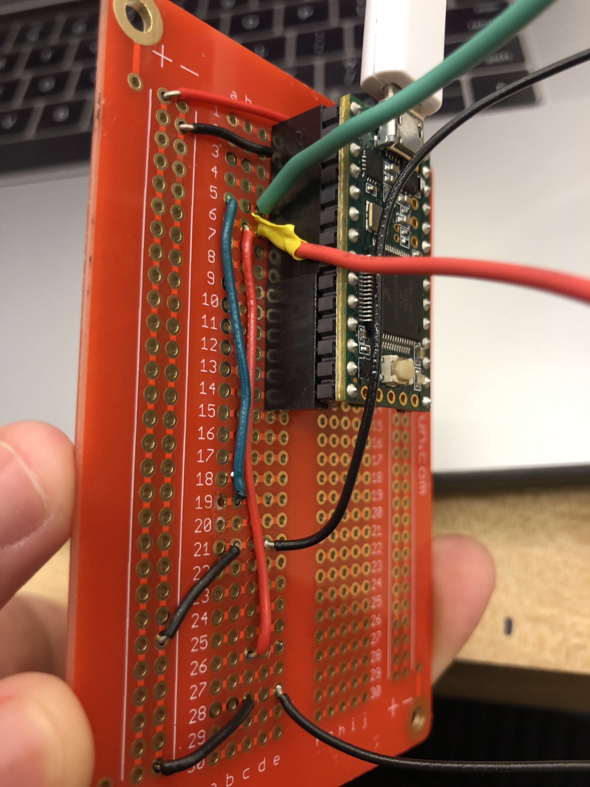
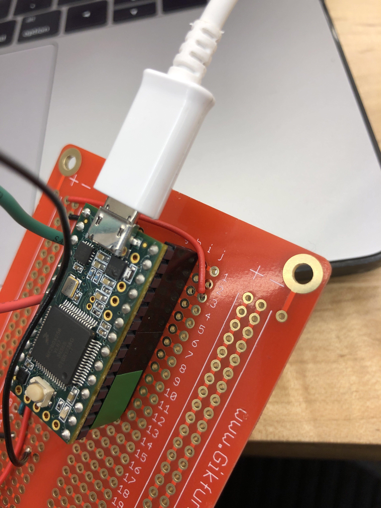
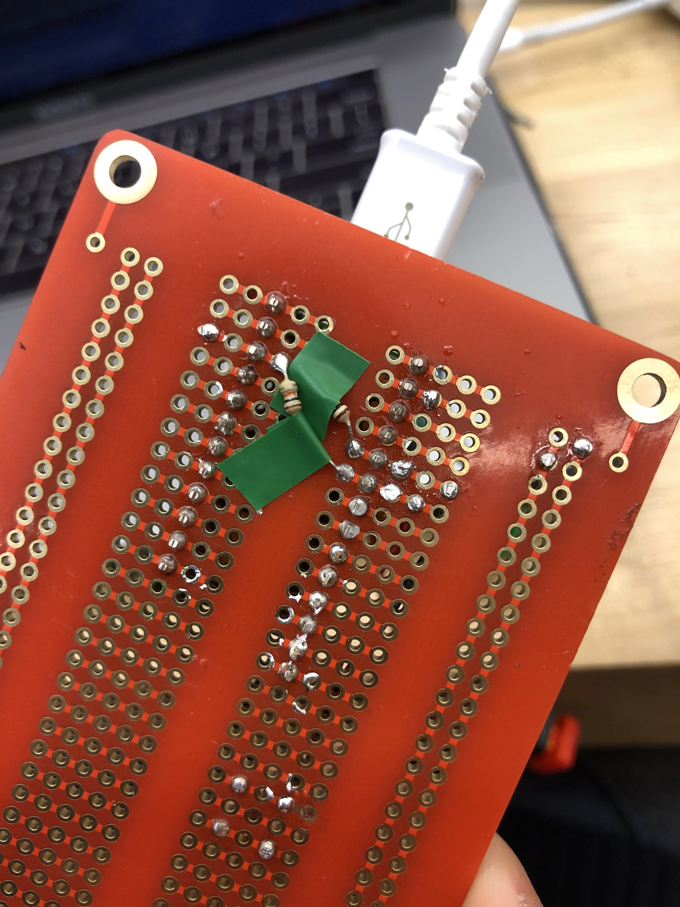

# CP2Final
 Final project for Computational Practices Spring 2019 @ California College of the Arts

For this project, I modified my HTML/CSS Anime Meme Timeline from my Interactive 1 class, and made it controllable with buttons instead of a mouse or a keyboard. The project contains three major parts: the visual content of the site, a Teensy 3.2 board connected to 2 buttons, and a set of JavaScript (node) code that the board uses to communicate with the local host site. 

When displayed, the buttons are connected to a computer that is also connected to a projector. Large images are projected onto a wall as users press the buttons.

Here is a link to a video that shows what the Animeme Timeline site looks like: https://youtu.be/DIdiyMyarJs

Here is what the final display looks like: 

Here is my board:

